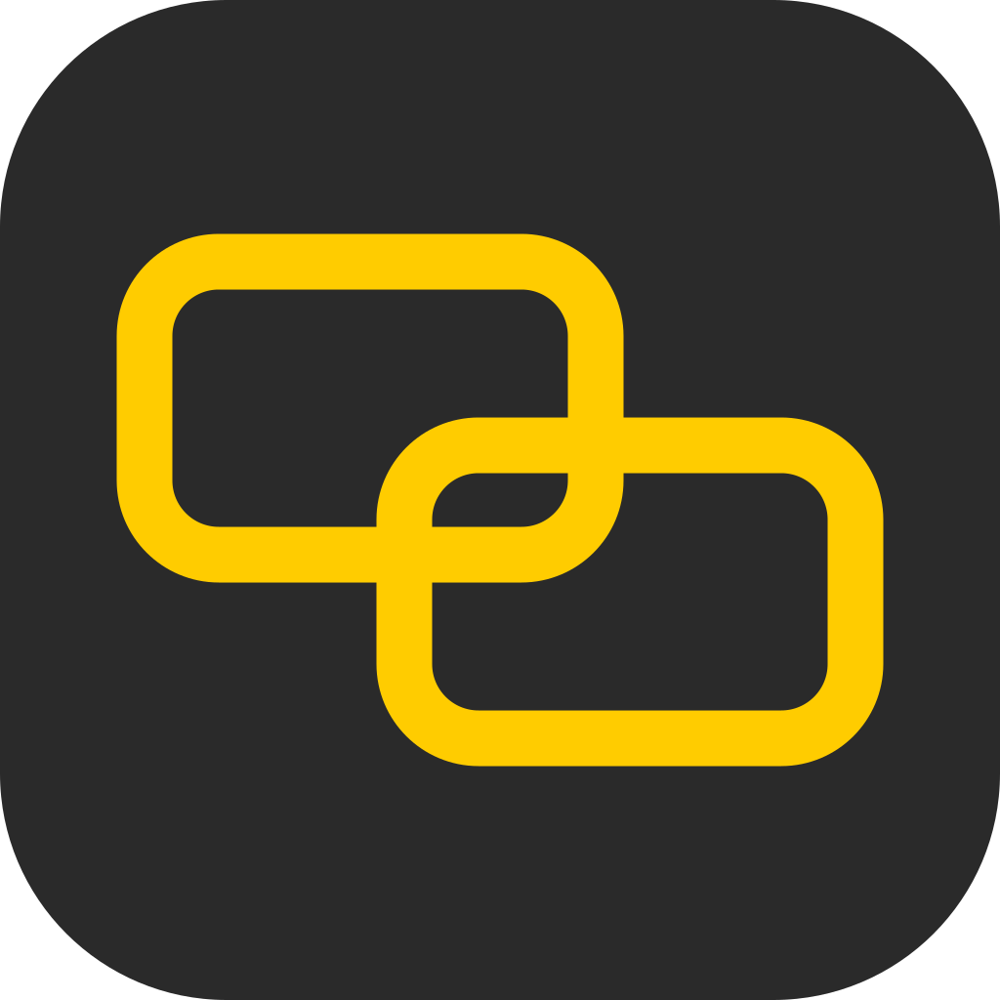

<p align="center"></p>

# BoundGate

Device-bound zero-trust remote access. A device gets in only with a key that
cannot leave it (TPM 2.0, later Secure Enclave), a user only with OIDC, and
every flow only if a Cedar policy says so. The tunnel is standard HTTP/3:
CONNECT-IP (RFC 9484) over QUIC on UDP/443.

Status: prototype, milestone M8 stage 1 (macOS menu-bar app, see `docs/MACOS-APP.md`; server deployment with built-in Let's Encrypt, see `docs/DEPLOY.md`; TPM 2.0 device keys incl. VM vTPMs, `hardware_bound` as a signed binding field, see `docs/TPM.md`; macOS endpoint, see `docs/MACOS.md`; node model: control plane on port 443,
one `boundgate-node` binary with the roles endpoint / subnet-router / hub /
exit-node, hub-and-spoke overlay with HA; enrollment with manual admin
confirmation and an admin-signed binding (SSHSIG, YubiKey) that every node
verifies, so the control plane cannot invent or upgrade nodes; pinned
control-plane key; OIDC user login with sessions bound to the node and
enforced by hubs; Cedar access policies with per-flow decisions, SNI/DNS
inspection and shipped flow and tunnel logs; an embedded admin UI (Svelte)
behind OIDC + passkey admin logins, with a policy builder and a live
sanity check; local compose lab). See `docs/ARCHITECTURE.md`,
`docs/TCB.md`, `docs/SECURITY.md`, `docs/BINDINGS.md`, `docs/OIDC.md`,
`docs/ACL.md`, `docs/ADMIN-AUTH.md`, `docs/MACOS.md`, `docs/DESIGN.md` and `docs/DEV.md`.

```bash
make test
make compose-up && make setup-dev   # dev admin key, overlay pool, enroll + confirm + sign hub1, hub2, node-r, node-a
cd deploy/compose && docker compose exec node-a boundgatectl up && ./setup-dev.sh login node-a
make e2e                            # up -> login -> targets -> ACL -> hub failover -> session revoke -> node revoke -> re-enroll -> sign flow -> tampering -> key pin -> admin UI/auth
open http://localhost:18080         # admin UI through the lab's devproxy; first passkey needs deploy/compose/state/control/bootstrap.token
```
